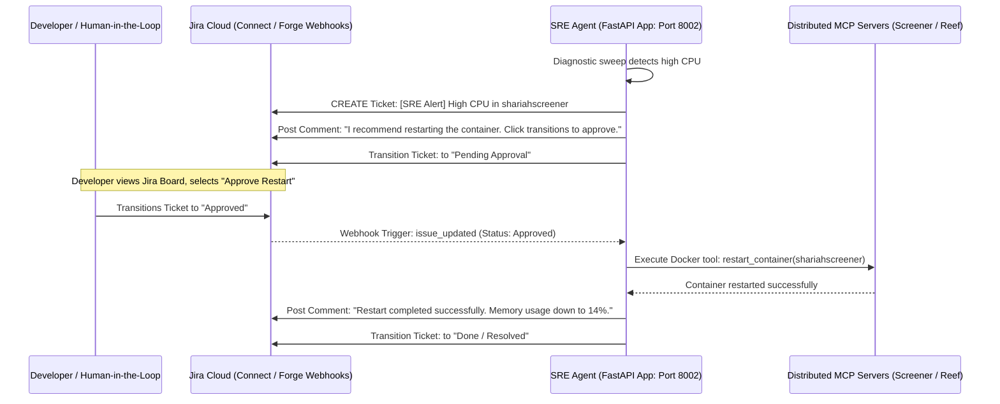

# Architectural Blueprint: Jira Dashboard Integration for SRE Agent

Integrating the SRE Agent directly into Jira replaces the custom Next.js UI / local HTML approval gates with a production-grade, enterprise-native collaboration framework. The agent acts like an autonomous SRE team member that responds to ticket transitions, posts analytical logs as comments, and requests permission for destructive commands directly within Jira workflows.

---

## 🛠️ Key Architectural Changes

### 1. The HITL Approval Gate Shifts to Jira Custom Workflows
*   **Current Plan**: The SRE Agent polls a local PostgreSQL database waiting for status changes written by a custom FastAPI HTML page.
*   **Jira Plan**: 
    *   We define a custom workflow status in Jira: `Pending SRE Approval`.
    *   We add two transition buttons in Jira: `Approve SRE Action` and `Reject SRE Action`.
    *   When the agent triggers a destructive tool (e.g. `restart_container`), the tool posts a description comment on the corresponding ticket, changes the ticket status to `Pending SRE Approval`, and enters a listener state.
    *   When the user transitions the ticket in Jira, Jira sends a webhook callback to SRE Agent (`POST /api/jira/webhook`). SRE Agent updates the internal status and allows the tool thread to execute or abort.

### 2. Issue-Driven Execution (Webhook Listener)
*   **Current Plan**: A 30-minute background cron task triggers SRE diagnostics.
*   **Jira Plan**:
    *   In addition to cron diagnostics, SRE Agent handles incoming command queries from Jira tickets.
    *   By listening to the `issue_commented` webhook, the agent scans comments for mentions: `@SRE-Agent check compliance for AAPL` or `@SRE-Agent list containers`.
    *   The agent processes the query using its LLM reasoning loop, invokes the corresponding MCP tools (such as checking stock databases or querying running Docker lists), and prints the markdown result directly as a reply comment on the issue.

### 3. telemetries & Log Dumping
*   When SRE diagnostic sweeps fail or container exceptions occur, the agent logs them directly to Jira. It formats the system diagnostics, latency tables, or trace strings, and uploads them as a markdown comment or text attachment directly to the Jira ticket.

---

## 📋 Adjusted Micro-Steps for Phase 3

To pivot the current implementation plan to a Jira-centric layout, we adjust the steps as follows:

### 1. Requirements & Core configuration
*   **1.1** Install `jira` (Python Jira client library) and `cryptography` in `services/sre-agent/requirements.txt` to enable authenticating with Jira REST APIs.
*   **1.2** Expose a webhook endpoint in SRE FastAPI app: `POST /api/jira/webhook` in [server.py](file:///home/rafi/projects/aegis-platform/services/sre-agent/server.py).
*   **1.3** Provision a Jira API Token and add variables (`JIRA_URL`, `JIRA_USER_EMAIL`, `JIRA_API_TOKEN`, `JIRA_PROJECT_KEY`) to the root `.env` file.

### 2. Jira Webhook Processor (`jira_tools.py`)
*   **2.1** Create a new helper module in SRE Agent: `services/sre-agent/src/api/jira_tools.py`.
*   **2.2** Implement signature verification to ensure incoming webhooks originate securely from Atlassian.
*   **2.3** Write parser handlers to extract user comments, transitions, and issue keys from the webhook JSON body.

### 3. SRE Agent Orchestrator Adaptations
*   **3.1** Refactor `orchestrator.py` to route agent output directly to Jira.
*   **3.2** Adapt the HITL blocking logic in destructive tools:
    *   Instead of writing to `audit_trails` Postgres table, call Jira REST API: create a comment explaining the request, assign it to the reporter, and change issue status to `Pending SRE Approval`.
    *   Expose a FastAPI endpoint `/api/jira/webhook` that accepts transition changes, maps the `issue_key` to the waiting thread, and resumes execution upon receiving `APPROVED`.

### 4. Setup Jira Webhooks & Workflow Transitions
*   **4.1** In your Jira Cloud Settings, configure a Webhook pointing to `https://<sre-agent-public-url>/api/jira/webhook`.
*   **4.2** Define transition rules that restrict clicking "Approve SRE Action" to authorized SRE Administrators (using Jira permission schemas).

---

## 🔍 Verification Plan

1. **Jira Integration Test**: Run a local testing script in SRE Agent `scratch/` directory that fetches the Jira project issues list and prints them to verify connection and API key authentication validity.
2. **Comment Query Test**:
   - Create a comment `@SRE-Agent check_server_health` on an open ticket.
   - Verify the SRE Agent receives the webhook, runs the health command, and appends a comment with the memory/disk usage table.
3. **Approval Lifecycle Test**:
   - Comment `@SRE-Agent restart shariahscreener`.
   - Verify the agent creates a child task / sub-task (or changes status to `Pending SRE Approval`) and comments: "Restart request submitted. Awaiting approval."
   - Click the "Approve SRE Action" button in Jira.
   - Verify that the webhook fires, the SRE Agent executes the container restart, and transitions the ticket to `Resolved` with the execution logs attached.
