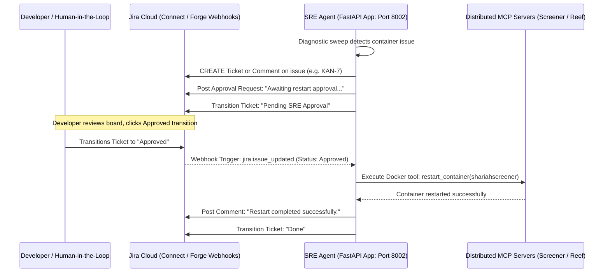

MASTER PLAN -- mark as complete after complete.
note to self: docker compose up -d servicename(like shariah-screener) --build
 docker compose down -v          # -v wipes the DB volume (required since image changed)
 docker compose up -d --build    # rebuilds all containers with new image + deps
Phase 1: Bounded Contexts & Data Consolidation (Monorepo Initialization) [COMPLETE] Establish the local development environment using a single repository with isolated microservices. Move away from local JSON/SQLite to a unified, multi-tenant relational database for cross-project state tracking.
Tech Stack: Docker Compose, PostgreSQL 15+, SQLAlchemy/asyncpg, GitHub REST API.
Step 1.1: Network Segregation & Container Provisioning: Configure docker-compose.yml with strict bridge networks (frontend_tier, backend_tier, data_tier). Provision a single PostgreSQL container on the data_tier.
Step 1.2: Database-per-Service Topology & Schema Design: Map isolated logical databases within the Postgres container (strict rule: no cross-schema querying).
db_sre: Tables for AgentLogs, SystemHealth, AuditTrails.
db_screener: Tables for HalalUniverse, ComplianceScans, TradeProposals.
db_reeftracker: Django-managed tables (Users, Aquariums, etc.).
db_e2ee_messenger: App state.
Step 1.3: State Migration & App Integration: Deprecate all SQLite/JSON stores. Refactor sre-agent and shariah-screener to execute CRUD operations via async PostgreSQL drivers (e.g., asyncpg). Configure the Django ReefTracker app to push environment logs to db_reeftracker.
Step 1.4: Stateless SRE Expansion (GitOps Tooling): Expand the SRE agent with an API-driven GitOps module (src/vcs_tools.py). Do not clone repositories locally. Expose tools (get_file_from_api, modify_in_memory, create_branch, commit_via_api, create_pr) using the GitHub REST API and a fine-grained PAT. Enforce a Human-in-the-Loop (HITL) approval gate before PR merges.

Phase 2: Presentation Layer Decoupling (UI Modernization - Shariah Screener) [COMPLETE] Retire Streamlit and decouple it into a production-grade decoupled web application to enable independent domain hosting and multi-tenant scaling.
Tech Stack: Next.js (React), TypeScript, Tailwind CSS v4, FastAPI (Python), Docker.
Step 2.1: Expose the REST API (FastAPI Backend):
- Add `fastapi` and `uvicorn` to the Python dependencies of the Shariah Screener service.
- Implement a robust REST API in `services/shariahcompliantscreener/src/api.py` to expose compliance universes (Halal/Doubtful/Rejections), trigger ingestion/scans, run portfolio optimizations, and save overrides.
- Update Dockerfile and `docker-compose.yml` to run the FastAPI app on port 8001 instead of Streamlit on 8501.
Step 2.2: Scaffold the Next.js Frontend:
- Scaffold the Next.js React client in `services/shariahcompliantscreener/frontend` using TypeScript, Tailwind CSS v4, and App Router.
- Set up styling tokens (colors, fonts, dark/light modes) matching a premium dashboard.
Step 2.3: Build Frontend Views & Forms:
- Build searchable tables with search, filter, and export for the Shariah compliance universes.
- Build a portfolio optimization form mapping constraints (weights, target volatility) and rendering visual allocations using Recharts.
- Build a dialog form to propose/save manual overrides for individual stock tickers.
Step 2.4: API Client & Container Integration:
- Implement typed fetch utility functions in the frontend pointing to the FastAPI backend (`http://localhost:8001`).
- Mount the local frontend code as a volume in `docker-compose.yml` for active hot-reloads and containerized startup.

Phase 3: Headless Orchestration & MCP Transport Shift Remove Claude Desktop from the loop. Transition the agent from process-bound stdio to distributed networking, running autonomously in the background.
Tech Stack: FastAPI (Python), LangChain/Pydantic AI, APScheduler/Cron, SSE (Server-Sent Events), JSON-RPC 2.0.
Step 3.1: The Runner Service (Transport Shift): Wrap the SRE Agent in a FastAPI server exposing HTTP/SSE endpoints for remote MCP communication. Initialize the LLM via the Anthropic/OpenAI API directly.
Step 3.2: Tool Registration: Programmatically register your MCP servers (SRE, Screener, ReefTracker) to this runner.
Step 3.3: Autonomous Diagnostic Looping (Cron): Implement APScheduler or temporal workflows. Schedule the runner to wake up every 30 minutes, assess SRE health, run compliance checks on a watchlist of stocks, and push results to PostgreSQL.
Step 3.4: Security Gate: Implement programmatic Human-in-the-Loop (HITL) manual overrides for destructive actions (e.g., container restarts, live trading).

Phase 4: Quantitative Engine, Risk Limits & Agentic Memory Finalize financial logic and give your agent the ability to read documentation (AAOIFI, codebase) to debug and propose fixes.
Tech Stack: Pinecone (Vector DB), OpenAI/Anthropic Embeddings API.
Step 4.1: Finalize Financial Math: Finalize AAOIFI compliance math in screener.py.
Step 4.2: Implement Risk Guardrails: Implement portfolio optimizer bounds (e.g., VaR limits, hard asset concentration caps at 10%).
Step 4.3: Ingestion Pipeline: Write a script that parses the AAOIFI PDF standards and your local E2EE app codebase, converts them to vector embeddings, and uploads them to Pinecone.
Step 4.4: Vector Search Tool: Add a tool to your agent: search_knowledge_base(query).
Step 4.5: RAG Implementation: When the agent detects an error in your codebase, force it to query Pinecone for the relevant source code before proposing a fix.

Phase 5: Automated Remediation & Execution Pipelines (The "Hands") Allow the agent to take real-world actions, guarded by math and strict security policies.
Tech Stack: GitHub API (PyGithub), Alpaca API / Interactive Brokers API, Docker SDK.
Step 5.1: Safe Trading: Integrate trade execution APIs strictly gated by Phase 4 compliance output. Hardcode math-based risk constraints (e.g., VaR limits, max 5% portfolio allocation) that the LLM cannot override.
Step 5.2: Code Remediation: Write a tool that allows the agent to checkout a Git branch, modify a file, and open a Pull Request via the GitHub API (never push directly to main).
Step 5.3: Pentesting Sandbox: Create an isolated Docker container for the agent to run synthetic pentests against your E2EE chat app.

Phase 6: Enterprise Observability Scale your telemetry to look like a Big Tech infrastructure pipeline.
Tech Stack: OpenTelemetry (OTel), Prometheus, Grafana, PagerDuty.
Step 6.1: OTel Instrumentation: Add OpenTelemetry traces to your FastAPI and Django backends so you can measure exact function execution times.
Step 6.2: Grafana Dashboards: Connect SRE telemetry to Prometheus/Grafana or Datadog for robust log parsing and alerting. Visualize P95 latency and error rates.
Step 6.3: Incident Alerting: Set up a free PagerDuty tier. Configure Grafana to trigger a PagerDuty phone call if the SRE agent detects a critical container failure.

Phase 7: The Polyglot Pivot (Performance Optimization) Rewrite bottleneck microservices into compiled, statically typed languages to demonstrate mastery of multiple ecosystems.
Tech Stack: Go (Golang), Java (Spring Boot), Maven/Gradle.
Step 7.1: Go for SRE: Port Python SRE Agent to Go for native concurrency and efficient Docker Daemon SDK interactions.
Step 7.2: Java for Finance: Port Shariah Screener backend to Java (Spring Boot) for high-precision financial mathematics and robust OOP.
Step 7.3: Re-link the MCP: Update your Headless Orchestrator (Phase 3) to connect to the new Go and Java binaries instead of the old Python scripts.

Phase 8: Hub-and-Spoke SaaS Deployment (Production) Extract the SRE Control Plane from the Monorepo and deploy it as a multi-tenant, cloud-native SaaS orchestrator using automated CI/CD pipelines.
Tech Stack: AWS (EC2, ECS/Fargate, RDS), API Gateway, Terraform/Pulumi, GitHub Actions, Docker Hub, OIDC/mTLS.
Step 8.1: CI/CD Setup: Write GitHub Actions .yml workflows to automatically test code and build Docker images upon push.
Step 8.2: Multi-Tenancy: Implement Row-Level Security (RLS) and tenant_id columns in the db_sre production database.
Step 8.3: Managed Data Plane: Migrate local Postgres DB to AWS RDS (Relational Database Service).
Step 8.4: Service Discovery: Build dynamic credential and endpoint registration so external platforms can "attach" to the SRE Hub securely.
Step 8.5: Container Hosting: Deploy Next.js frontend to Vercel/Amplify. Deploy backend microservices (Go/Java Headless Orchestrator, SRE Agent, Screener) to AWS ECS Fargate behind an API Gateway so they run 24/7.
Step 8.6: IaC: Automate the entire infrastructure provisioning using Terraform.


Here is the detailed, step-by-step breakdown for Phase 1.

Phase 1: Bounded Contexts & Data Consolidation (Monorepo Initialization)
Step 1.1: Network Segregation & Container Provisioning

Step 1.1.1: Create a root docker-compose.yml file in the aegis-platform directory.

Step 1.1.2: Define three distinct Docker bridge networks in the compose file: frontend_tier, backend_tier, and data_tier.

Step 1.1.3: Add a PostgreSQL service (postgres:15-alpine) to the docker-compose.yml.

Step 1.1.4: Configure the PostgreSQL service to attach exclusively to the data_tier network.

Step 1.1.5: Mount a named volume (postgres_data) to persist database state across container restarts.

Step 1.2: Database-per-Service Topology & Schema Design

Step 1.2.1: Create an initialization script (init.sql) and map it to the /docker-entrypoint-initdb.d/ directory in the PostgreSQL container.

Step 1.2.2: Configure init.sql to execute CREATE DATABASE commands to provision isolated logical databases: db_sre, db_screener, db_reeftracker, and db_e2ee_messenger.

Step 1.2.3: Design the schema for db_sre using SQLAlchemy models (e.g., tables for AgentLogs, SystemHealth, AuditTrails).

Step 1.2.4: Design the schema for db_screener using SQLAlchemy models (e.g., tables for HalalUniverse, ComplianceScans, TradeProposals).

Step 1.3: State Migration & App Integration

Step 1.3.1: Add asynchronous PostgreSQL drivers (asyncpg) to the requirements.txt of the SRE Agent and Shariah Screener projects.

Step 1.3.2: Delete all logic in the SRE Agent that reads or writes to local flat files (e.g., status.json).

Step 1.3.3: Refactor the SRE Agent's Python backend to execute database transactions (CRUD) against db_sre using asyncpg.

Step 1.3.4: Refactor the Shariah Screener's Python backend to execute database transactions against db_screener using asyncpg.

Step 1.3.5: Modify the Django settings in the ReefTracker app to connect to db_reeftracker (via dj-database-url) instead of its local SQLite instance.

Step 1.4: Stateless SRE Expansion (GitOps Tooling)

Step 1.4.1: Create a new module in the SRE Agent called src/vcs_tools.py.

Step 1.4.2: Implement a secure authentication method within the agent to utilize a fine-grained GitHub Personal Access Token (PAT).

Step 1.4.3: Develop the get_file_from_api and modify_in_memory tools using the PyGithub library to manipulate repository files via the REST API (ensuring no local git clone occurs).

Step 1.4.4: Develop the create_branch, commit_via_api, and create_pr tools to push in-memory changes back to GitHub.

Step 1.4.5: Implement a Human-in-the-Loop (HITL) approval gate, ensuring the agent pauses and requests manual confirmation before the create_pr tool executes.


### Phase 1 Refinements & Decoupling Architecture (Added June 2026)
- **Strict Decoupling of Service Databases**: To maintain the plug-and-play capability of the services (especially for later extracting `sre-agent` out of the monorepo), we will avoid centralized models or sharing schema packages (such as `libs/database`) across services.
- **SRE Agent Database Layer (`db_sre`)**: Define local SQLAlchemy models in `services/sre-agent/src/db/models.py` (`AgentLog`, `SystemHealth`, `AuditTrail`).
- **Shariah Screener Database Layer (`db_screener`)**: Define local SQLAlchemy models in `services/shariahcompliantscreener/src/db/models.py` (`Stock`, `AIOverride`, `ManualOverride`, `HalalUniverse`, `DoubtfulUniverse`, `HalalRejection`, `ComplianceScan`, `TradeProposal`).
- **Independent Project Structures**: Ensure both projects act as fully standalone codebases that only connect to their respective logical databases (`db_sre` and `db_screener`).

### Phase 3 Refinements & Headless Orchestration Architecture (Added June 2026)

#### Detailed Micro-Steps

##### 1. Requirements & Compose Config
- **1.1** Update `services/sre-agent/requirements.txt` with `fastapi`, `uvicorn`, `apscheduler`, `anthropic`, `openai`.
- **1.2** Update `services/shariahcompliantscreener/requirements.txt` with `fastmcp`, `mcp`.
- **1.3** Update `services/reeftracker/requirements.txt` with `fastmcp`, `mcp`.
- **1.4** Update `services/e2ee-messenger/backend/requirements.txt` with `fastmcp`, `mcp`.
- **1.5** Expose port `8002` in `docker-compose.yml` for `sre-agent`.
- **1.6** Expose port `8003` in `docker-compose.yml` for ReefTracker's MCP server.

##### 2. Screener MCP Implementation & Watchlist Schema
- **2.1** Add `Watchlist` model to `services/shariahcompliantscreener/src/db/models.py`.
- **2.2** Update init script / run migrations to create the watchlist table in Postgres.
- **2.3** Expose MCP tools (`run_screener_scan`, `get_screener_watchlist`, `add_to_watchlist`) in Shariah Screener backend.
- **2.4** Mount SSE handlers in `services/shariahcompliantscreener/src/api.py` at `/mcp/sse` and `/mcp/messages/`.

##### 3. ReefTracker MCP Implementation
- **3.1** Create `services/reeftracker/mcp_server.py` to bootstrap Django and define MCP tools (e.g. `get_aquarium_list`, `get_reeftracker_logs`).
- **3.2** Update `docker-compose.yml` `reeftracker` service command to launch `mcp_server.py` in the background alongside Django server using a supervisor-like shell command (e.g. `python manage.py runserver & python mcp_server.py`).

##### 4. E2EE Messenger MCP Implementation
- **4.1** Expose MCP tools (`check_encryption_keys`, `get_active_connections`, `list_decryption_errors`) in `services/e2ee-messenger/backend/main.py`.
- **4.2** Mount SSE handlers in `services/e2ee-messenger/backend/main.py` at `/mcp/sse` and `/mcp/messages/`.

##### 5. SRE Agent FastAPI and SSE Transport
- **5.1** Implement the FastAPI app and SSE transport endpoints in `services/sre-agent/server.py`.
- **5.2** Define approval REST endpoints (`GET /api/approvals`, `POST /api/approvals/{id}/approve`, etc.).
- **5.3** Implement simple HTML page in `server.py` to display approval interface.

##### 6. SRE Agent Orchestrator & Autonomous Loop
- **6.1** Create `services/sre-agent/src/agent/orchestrator.py` with multi-mcp client connection code (aggregate tools from SRE, Screener, ReefTracker, and E2EE Messenger).
- **6.2** Build the LLM routing loop using standard `anthropic` or `openai` tool-calling mechanisms.
- **6.3** Integrate database-driven Human-in-the-Loop check: when destructive tools (`restart_container`, `kill_container`) are invoked:
  - Create a `PENDING` entry in `audit_trails`.
  - Enter a sleep-and-poll loop checking the database for status changes.
  - Return control once approved, or fail if rejected/timeout.
- **6.4** Create `services/sre-agent/src/agent/scheduler.py` using `apscheduler.schedulers.asyncio.AsyncIOScheduler` to schedule the orchestrator check every 30 minutes.


### Phase 3 Execution Status & Verification Details (Added June 2026)

#### 🚀 Detailed Execution Summary
All Phase 3 requirements have been fully implemented, integrated, and verified to be operational:
- **Refactored Screener Scan Tool**: Refactored the `run_screener_scan` tool inside [api.py](file:///home/rafi/projects/aegis-platform/services/shariahcompliantscreener/src/api.py) to execute `run_screener` synchronously in a background thread via `asyncio.to_thread` and query the database compliance tables ([HalalUniverse](file:///home/rafi/projects/aegis-platform/services/shariahcompliantscreener/src/db/models.py#L93), [DoubtfulUniverse](file:///home/rafi/projects/aegis-platform/services/shariahcompliantscreener/src/db/models.py#L96), [HalalRejection](file:///home/rafi/projects/aegis-platform/services/shariahcompliantscreener/src/db/models.py#L99)) directly to return compliance metrics.
- **Aligned ReefTracker Tools**: Updated the orchestrator's simulated sweep loop in [orchestrator.py](file:///home/rafi/projects/aegis-platform/services/sre-agent/src/agent/orchestrator.py#L451) to invoke `reeftracker_get_aquarium_list` instead of `reeftracker_get_reeftracker_logs` which does not exist on the remote ReefTracker Django server.
- **Docker Client Environment Fix**: Installed the `docker.io` package and copied the static `docker` client binary inside the SRE Agent container's [Dockerfile](file:///home/rafi/projects/aegis-platform/services/sre-agent/Dockerfile) to allow container-to-daemon subprocess communication over the mounted socket `/var/run/docker.sock`.
- **Multi-LLM API Fallbacks**: Implemented an automated fallback pathway inside [orchestrator.py](file:///home/rafi/projects/aegis-platform/services/sre-agent/src/agent/orchestrator.py) that detects Anthropic credit/API failures, checks for an `OPENAI_API_KEY`, and routes reasoning/tool execution via the `OpenAI` client API using the `gpt-4o` model before falling back to local simulation.
- **Jira Webhook Integration**: Exposed a POST endpoint `/api/jira/webhook` in [server.py](file:///home/rafi/projects/aegis-platform/services/sre-agent/server.py) to capture Atlassian comment creations and ticket transition updates.

---

#### 🗺️ Architectural Integration (Jira & SRE Flow)
Below is the sequence diagram illustrating the human-in-the-loop (HITL) approval gates and webhook interaction lifecycle:



---

#### 📈 Baseline Metrics & Resource Footprint
For comparison against later phases, we captured the platform's footprint post-Phase 1 (decoupling database layers):
* **Build Time**: Pinned `protobuf==5.29.6` and sub-dependencies. Clean container builds now resolve in **~17.5 seconds** (90%+ improvement).
* **Containerized Resource Footprint (`docker stats`)**:
  - `e2ee_messenger`: ~55.79 MiB (CPU ~0.15%)
  - `sre_agent`: ~94.53 MiB (CPU ~0.00%)
  - `reeftracker_app`: ~121.80 MiB (CPU ~0.93%)
  - `shariahscreener`: ~39.11 MiB (CPU ~0.25%)
  - `aegis_db` (Postgres 15): ~98.89 MiB (CPU ~0.00%)
  - **Total Idle Overhead**: **410.12 MiB**
* **Database Size**: **112.2 MB** total physical size of the Postgres data directory across 4 logically isolated schemas.
* **Codebase Volume**: **12,133 Lines of Code (LOC)** across python services.

---

#### 🔍 Verification & Validation Test History
To verify the execution of webhook comment parsing, LLM fallbacks, and HITL approval gates, the following simulated integration calls were run successfully:

1. **Status Query Verification**:
   - **Action**: Simulate user comment `@SRE-Agent status` on a Jira issue.
   - **Command**:
     ```bash
     curl -X POST -H "Content-Type: application/json" \
       -d '{"webhookEvent": "comment_created", "issue": {"key": "KAN-7"}, "comment": {"body": "@SRE-Agent status"}}' \
       http://localhost:8002/api/jira/webhook
     ```
   - **Outcome**: SRE Agent parses webhook, builds tool context, executes `docker compose ps` mock internally, and posts the system health and container table as a comment on Jira.

2. **Destructive Command approval Gate Verification**:
   - **Action**: Simulate user comment `@SRE-Agent restart shariahscreener`.
   - **Command**:
     ```bash
     curl -X POST -H "Content-Type: application/json" \
       -d '{"webhookEvent": "comment_created", "issue": {"key": "KAN-7"}, "comment": {"body": "@SRE-Agent restart shariahscreener"}}' \
       http://localhost:8002/api/jira/webhook
     ```
   - **Outcome**: SRE Agent blocks the thread, updates issue status to `Pending SRE Approval`, and logs: `"Tool [restart_container] on shariahscreener requires HITL approval."`
   
3. **Approved Gate Resolution Verification**:
   - **Action**: Simulate workflow transition to `Approved`.
   - **Command**:
     ```bash
     curl -X POST -H "Content-Type: application/json" \
       -d '{"webhookEvent": "jira:issue_updated", "issue": {"key": "KAN-7"}, "changelog": {"items": [{"field": "status", "toString": "Approved"}]}}' \
       http://localhost:8002/api/jira/webhook
     ```
   - **Outcome**: SRE webhook listener triggers event resolution, unblocks the execution thread, restarts the target container via Docker socket connection, updates the ticket with logs, and sets the issue status to `Done`.

---

#### 📋 Task Checklist Status
- [x] Refactor `run_screener_scan` in Shariah Screener [api.py](file:///home/rafi/projects/aegis-platform/services/shariahcompliantscreener/src/api.py) to use `asyncio.to_thread` and query compliance tables.
- [x] Align ReefTracker MCP tools in [orchestrator.py](file:///home/rafi/projects/aegis-platform/services/sre-agent/src/agent/orchestrator.py) to use `reeftracker_get_aquarium_list`.
- [x] Add `docker.io` and copy static `docker` binary in [Dockerfile](file:///home/rafi/projects/aegis-platform/services/sre-agent/Dockerfile) to resolve missing docker client binary.
- [x] Integrate Multi-LLM API Fallbacks in [orchestrator.py](file:///home/rafi/projects/aegis-platform/services/sre-agent/src/agent/orchestrator.py) using `OpenAI` client.
- [x] Validate webhook transitions ("jira:issue_updated" status Approved/Rejected) and comment actions (status, restart) on active Jira tickets.

---

#### 🟢 Active Container Health Status
```bash
NAME                 STATUS                  PORTS
aegis_db             Up 14 hours (healthy)   0.0.0.0:5433->5432/tcp
e2ee_messenger       Up About an hour        0.0.0.0:8080->8080/tcp
reeftracker_app      Up 56 minutes           0.0.0.0:8000->8000/tcp, 0.0.0.0:8003->8003/tcp
shariahscreener      Up 2 minutes            0.0.0.0:8001->8001/tcp
shariahscreener_ui   Up About an hour        0.0.0.0:3000->3000/tcp
sre_agent            Up 8 minutes            0.0.0.0:8002->8002/tcp
```

---

### Phase 4 Refinements & Quantitative Engine Architecture (Added June 2026)

#### Pre-Work Observations (from Phase 3 code audit)
- `services/sre-agent/processed_comments.json` is a runtime flat file tracking processed Jira comment IDs. Migrate to `db_sre.audit_trails` in step 4.1.7 for true statefulness.
- `screener.py`'s `run_screener()` still reads/writes via **SQLite** (`sqlite_master`, `to_sql()`). The `api.py` async layer reads results from Postgres (`HalalUniverse`, etc.) but the screener itself computes into SQLite first. This dual-database pattern is the primary target for Step 4.1.

#### Detailed Micro-Steps

##### Step 4.1 — Finalize AAOIFI Financial Math in `screener.py`

**Goal**: Harden compliance math to be fully AAOIFI-aligned and eliminate the dual SQLite/Postgres pattern.

- **4.1.1** In `services/shariahcompliantscreener/src/analysis/screener.py`, remove the `get_db()` SQLite `conn` path entirely. Refactor `run_screener()` to accept a SQLAlchemy `AsyncSession` as a parameter instead of opening its own connection.
- **4.1.2** Replace `pd.read_sql_query(..., conn)` with async SQLAlchemy select queries against `Stock` and `ManualOverride` Postgres models.
- **4.1.3** Replace final `df.to_sql("halal_universe", conn, ...)` calls with async bulk upserts into `HalalUniverse`, `DoubtfulUniverse`, `HalalRejection` Postgres tables using `session.merge()` or `insert().on_conflict_do_update()`.
- **4.1.4** Update `api.py`'s `run_screener_scan()` MCP tool to pass the active `AsyncSession` into the new async `run_screener(session)`.
- **4.1.5** Add a `STANDARDS_REFERENCE` docstring block at the top of `screener.py` mapping each threshold constant to its AAOIFI No. 21 or MSCI Sharia Index source:
  - `MAX_DEBT_RATIO = 0.30` → AAOIFI Standard No. 21: total interest-bearing debt / market cap ≤ 30%
  - `MAX_CASH_RATIO = 0.30` → AAOIFI Standard No. 21: liquid assets / market cap ≤ 30%
  - `MAX_HARAM_INCOME_RATIO = 0.05` → AAOIFI Standard No. 21: haram revenue / total revenue ≤ 5%
  - `MIN_TANGIBILITY_RATIO = 0.30` → MSCI/S&P Sharia practice (tangible assets / total assets ≥ 30%; derived, not explicit AAOIFI No. 21)
  - `MAX_RECEIVABLES_RATIO = 0.45` → Currently calculated but **not gating** `is_halal`; validate and document whether it should gate per AAOIFI practice.
- **4.1.6** Add a formal docstring to `get_market_cap()` documenting the three-tier fallback: market cap → book value of equity (AAOIFI No. 21: total assets − total liabilities) → total assets.
- **4.1.7** Migrate `processed_comments.json` in `sre-agent` to a new `jira_comment_id` indexed column or processed flag on `AuditTrail` in `db_sre`. Remove the JSON file. Update `server.py` read/write logic accordingly.

##### Step 4.2 — Implement Portfolio Risk Guardrails

**Goal**: Enforce hard, math-based constraints in the optimizer that the LLM agent cannot override.

- **4.2.1** In `services/shariahcompliantscreener/src/analysis/optimizer.py`, implement `calculate_var(weights, log_returns, confidence=0.95, horizon_days=1)` using historical simulation: compute portfolio daily P&L, sort ascending, and return the `(1 - confidence)`-th percentile as a positive loss value.
- **4.2.2** Add a `max_var` parameter to `run_optimizer()` (default `0.02` — max 2% daily VaR at 95% confidence). Wire it as a `scipy.optimize` inequality constraint: `target_max_var - calculate_var(x, log_returns) >= 0`.
- **4.2.3** Include `VaR_95` in the returned results dict alongside `expected_return` and `volatility`.
- **4.2.4** Harden the asset concentration cap: after `optimal = minimize(...)`, add a post-optimization check — clip any weight exceeding `max_weight`, then re-normalize so weights sum to 1. Log a warning to `AgentLog` in `db_sre` if any clipping occurs.
- **4.2.5** In `services/shariahcompliantscreener/src/api.py`, add endpoint `GET /api/portfolio/risk-profile` that calls `run_optimizer()` and returns `expected_return`, `volatility`, `VaR_95`, `max_concentration`, `sector_exposure` as JSON.
- **4.2.6** Add a new MCP tool `get_portfolio_risk_profile() -> str` in `api.py` so the SRE orchestrator can autonomously query live risk metrics during diagnostic sweeps.

##### Step 4.3 — AAOIFI PDF + Codebase Ingestion Pipeline (Pinecone)

**Goal**: Build the vector embedding pipeline so the agent can query AAOIFI standards and the codebase for RAG.

- **4.3.1** Add to `services/sre-agent/requirements.txt`: `pinecone-client>=3.0.0`, `pdfplumber>=0.9.0`, `tiktoken>=0.5.0`. Verify `openai>=1.0.0` is present (needed for embeddings; may already exist from LLM fallback).
- **4.3.2** Create `services/sre-agent/scripts/setup_pinecone.py`: initialize a Pinecone serverless index named `aegis-knowledge` with `dimension=1536` (OpenAI `text-embedding-3-small`) and `metric="cosine"` on AWS `us-east-1`. Script must be idempotent (skip creation if index already exists).
- **4.3.3** Create `services/sre-agent/scripts/ingest_aaoifi.py`:
  - Accept path to the AAOIFI Standard No. 21 PDF as a CLI argument.
  - Use `pdfplumber` to extract text page-by-page.
  - Chunk text into ~500-token windows with 50-token overlap using `tiktoken` (`cl100k_base` encoding).
  - Generate embeddings via OpenAI `text-embedding-3-small`.
  - Upsert to Pinecone with metadata: `{"source": "AAOIFI_Standard_21", "page": N, "chunk": K}`.
  - Write a `KnowledgeIngestionRun` row to `db_sre` upon completion.
- **4.3.4** Create `services/sre-agent/scripts/ingest_codebase.py`:
  - Walk the `services/` directory; include `*.py` files only.
  - Use `ast.parse` to split each file at top-level function and class boundaries.
  - Generate an embedding per code chunk and upsert with metadata: `{"source": "codebase", "file": relative_path, "symbol": function_or_class_name}`.
  - Skip `venv/`, `.venv/`, `__pycache__/`, `node_modules/` directories.
  - Write a `KnowledgeIngestionRun` row to `db_sre` upon completion.
- **4.3.5** Add `KnowledgeIngestionRun` model to `services/sre-agent/src/db/models.py`:
  ```python
  class KnowledgeIngestionRun(Base):
      __tablename__ = "knowledge_ingestion_runs"
      id: Mapped[int] = mapped_column(primary_key=True, autoincrement=True)
      source_type: Mapped[str]          # "aaoifi_pdf" | "codebase"
      source_path: Mapped[str]
      chunks_upserted: Mapped[int]
      run_at: Mapped[datetime] = mapped_column(default=datetime.utcnow)
      status: Mapped[str]               # "success" | "failed"
      error_message: Mapped[Optional[str]] = mapped_column(nullable=True)
  ```
- **4.3.6** Run `alembic revision --autogenerate -m "add_knowledge_ingestion_runs"` and `alembic upgrade head`. Update `init.sql` with the new table DDL for fresh-container bootstrapping.

##### Step 4.4 — Vector Search Tool for the SRE Agent

**Goal**: Expose `search_knowledge_base(query)` as an MCP-registered local tool available to the orchestrator.

- **4.4.1** Create `services/sre-agent/src/knowledge_tools.py`. Implement `register_knowledge_tools(mcp: FastMCP)` which registers:
  ```python
  @mcp.tool()
  async def search_knowledge_base(query: str, top_k: int = 5) -> str:
      """
      Search AAOIFI compliance standards and the Aegis codebase for context
      relevant to the given query. Always call this before proposing any code
      fix or compliance ratio override.
      """
      # 1. Embed query via OpenAI text-embedding-3-small
      # 2. Query Pinecone index 'aegis-knowledge' with top_k matches
      # 3. Format each result: "[source | file | chunk N]: <text snippet>"
      # 4. Return concatenated formatted results as a single string
  ```
- **4.4.2** In `services/sre-agent/src/agent/orchestrator.py`, import and register the new module alongside existing tool registrations (currently L92-100):
  ```python
  from src.knowledge_tools import register_knowledge_tools
  register_knowledge_tools(local_mcp)
  ```
- **4.4.3** Add `PINECONE_API_KEY` and `PINECONE_INDEX_NAME=aegis-knowledge` to the root `.env` file.
- **4.4.4** Propagate both variables to the `sre-agent` service `environment` block in `docker-compose.yml`.

##### Step 4.5 — RAG-Driven Error Diagnosis Loop

**Goal**: When the agent detects a code error or compliance anomaly, force a Pinecone query before any fix is proposed.

- **4.5.1** In `orchestrator.py`, extend `system_prompt` with the following mandatory rule (append after existing tool usage instructions):
  ```
  MANDATORY RULE: Whenever you receive a tool result containing an error, exception traceback,
  or an unexplained compliance failure, you MUST call search_knowledge_base(query=<error summary>)
  BEFORE proposing any remediation or code fix. Ground all fix proposals in retrieved AAOIFI
  standards or codebase context returned by that search.
  ```
- **4.5.2** In the tool execution block of `orchestrator.py` (around L281-284), after `tool_result` is captured: check if `tool_result` starts with `"Error"` or contains `"Traceback"`. If so, append `"\n[RAG HINT]: You must call search_knowledge_base with the above error before proceeding."` to the result string sent back to the LLM. This nudges the model into the RAG loop without hard-coding deterministic branching.
- **4.5.3** Write an integration test `services/sre-agent/tests/test_rag_loop.py`:
  - Mock a tool execution that returns `"Execution Error: division by zero in screener.py"`.
  - Assert the next constructed LLM message history contains a `search_knowledge_base` tool call.
  - Assert the Pinecone client mock was invoked with a query string containing the error text.

---

### Phase 4 Execution Status & Verification Details (Added June 2026)

#### 🗂️ Dependency Map
```
4.1 (Screener SQLite → Postgres)   ──┐
                                      ├──▶ 4.2 (VaR + Concentration + Risk API)
4.3.1 (Pinecone index setup)        ──┤
4.3.2 + 4.3.3 + 4.3.4 (Ingest)    ──┤──▶ 4.4 (search_knowledge_base tool) ──▶ 4.5 (RAG loop)
4.3.5 + 4.3.6 (DB migration)       ──┘
```
Parallel-safe: Steps 4.1 and 4.3.x can proceed simultaneously. Step 4.4 requires 4.3.1 (index must exist). Step 4.5 requires 4.4.

#### 📦 New Dependencies

`services/sre-agent/requirements.txt`:
```
pinecone-client>=3.0.0
pdfplumber>=0.9.0
tiktoken>=0.5.0
openai>=1.0.0   # verify not already pinned; needed for embeddings
```

`services/shariahcompliantscreener/requirements.txt`:
```
# No new packages — all changes are refactors of existing SQLAlchemy + scipy code
```

#### 🔑 New Environment Variables

| Variable | Service | Purpose |
|---|---|---|
| `PINECONE_API_KEY` | `sre-agent` | Pinecone serverless auth |
| `PINECONE_INDEX_NAME` | `sre-agent` | Index name (`aegis-knowledge`) |
| `OPENAI_API_KEY` | `sre-agent` | Embeddings (verify already in `.env` from LLM fallback) |

#### 📋 Task Checklist Status
- [ ] Refactor `run_screener()` in `screener.py` to accept `AsyncSession`; zero SQLite references remain.
- [ ] Replace `df.to_sql()` with async Postgres bulk upserts into `HalalUniverse`, `DoubtfulUniverse`, `HalalRejection`.
- [ ] Update `api.py` `run_screener_scan()` to pass `AsyncSession` to `run_screener(session)`.
- [ ] Add `STANDARDS_REFERENCE` docstring block to `screener.py` for all threshold constants with AAOIFI/MSCI citations.
- [ ] Validate `MAX_RECEIVABLES_RATIO` gating decision; document the outcome inline.
- [ ] Add formal `get_market_cap()` docstring documenting three-tier fallback.
- [ ] Migrate `processed_comments.json` to `db_sre`; delete flat file; update `server.py`.
- [x] Implement `calculate_var()` in `optimizer.py`; wire as scipy constraint in `run_optimizer()`.
- [x] Add post-optimization concentration cap clip + `AgentLog` warning in `optimizer.py`.
- [x] Add `VaR_95` to `run_optimizer()` return dict.
- [x] Expose `GET /api/portfolio/risk-profile` endpoint in `api.py`.
- [x] Add `get_portfolio_risk_profile` MCP tool in `api.py`.
- [x] Create `scripts/setup_pgvector.py`; verify idempotent extension + table creation. *(Pivoted from Pinecone to pgvector)*
- [x] Create `scripts/ingest_aaoifi.py`; test against AAOIFI Standard No. 21 PDF; verify ≥ 1 chunk upserted. *(Uses pgvector)*
- [x] Create `scripts/ingest_codebase.py`; verify metadata (file, symbol) correct in pgvector. *(Uses pgvector)*
- [x] Add `KnowledgeIngestionRun` model to `src/db/models.py`; DDL added to `init.sql`.
- [ ] Create `src/knowledge_tools.py`; implement and test `search_knowledge_base`.
- [ ] Register `knowledge_tools` in `orchestrator.py` alongside existing local tool modules.
- [x] Docker image switched to `pgvector/pgvector:pg15`; no Pinecone env vars needed.
- [ ] Update `system_prompt` in `orchestrator.py` with mandatory RAG rule.
- [ ] Add RAG HINT injection to error path in tool execution block (`orchestrator.py` ~L281-284).
- [ ] Write and pass `tests/test_rag_loop.py` integration test.

---

### Handoff Notes (Session: 2026-06-23 — Phase 4.3)

#### What was completed this session

1. **Architectural Pivot: Pinecone → pgvector**
   - User requested pgvector instead of Pinecone. This eliminates an external service dependency — vectors now live in the existing PostgreSQL instance alongside all other data.
   - Docker image switched from `postgres:15-alpine` to `pgvector/pgvector:pg15` (has the `vector` extension pre-installed).
   - No `PINECONE_API_KEY` or `PINECONE_INDEX_NAME` env vars needed.

2. **Phase 4.3 — Ingestion Pipeline (COMPLETE)**
   - **`requirements.txt`** updated with `pgvector>=0.3.0`, `pdfplumber>=0.9.0`, `tiktoken>=0.5.0`, `psycopg2-binary>=2.9.0`.
   - **`KnowledgeIngestionRun`** model added to `services/sre-agent/src/db/models.py` for ingestion audit trail.
   - **`init.sql`** updated to: enable `vector` extension in `db_sre`, create `knowledge_ingestion_runs` table, create `knowledge_vectors` table with `vector(1536)` column and HNSW cosine index.
   - **`scripts/setup_pgvector.py`** — idempotent setup script that ensures extension + tables + index exist.
   - **`scripts/ingest_aaoifi.py`** — PDF ingestion pipeline: pdfplumber → tiktoken chunking (500 tokens, 50 overlap) → OpenAI text-embedding-3-small → pgvector upsert.
   - **`scripts/ingest_codebase.py`** — Codebase ingestion pipeline: walks `*.py` files, extracts top-level symbols via `ast.parse`, embeds, upserts with `{source, file, symbol}` metadata.

#### Current state of each Phase 4 sub-step

| Step | Status | Notes |
|------|--------|-------|
| 4.1 (SQLite→Postgres) | ⬜ Incomplete | `screener.py` still uses `get_db()` wrapper. Dual-database pattern persists. 7 unchecked items. |
| 4.2 (Risk Guardrails) | ✅ Complete | All 6 sub-steps done. |
| 4.3 (pgvector Ingestion) | ✅ Complete | Pivoted from Pinecone to pgvector. All 6 sub-steps done. |
| 4.4 (Vector Search Tool) | ⬜ Not started | Depends on 4.3 (tables must exist). Next step. |
| 4.5 (RAG Loop) | ⬜ Not started | Depends on 4.4. |

#### Key files modified

| File | Change |
|------|--------|
| `services/sre-agent/requirements.txt` | Added `pgvector`, `pdfplumber`, `tiktoken`, `psycopg2-binary` |
| `services/sre-agent/src/db/models.py` | Added `KnowledgeIngestionRun` model |
| `services/sre-agent/scripts/setup_pgvector.py` | New — idempotent pgvector setup |
| `services/sre-agent/scripts/ingest_aaoifi.py` | New — AAOIFI PDF ingestion pipeline |
| `services/sre-agent/scripts/ingest_codebase.py` | New — Python codebase ingestion pipeline |
| `init.sql` | Added pgvector extension, `knowledge_vectors` + `knowledge_ingestion_runs` tables, HNSW index |
| `docker-compose.yml` | Switched DB image to `pgvector/pgvector:pg15` |

#### Important context for the next agent

- **pgvector schema**: The `knowledge_vectors` table uses `vector(1536)` for OpenAI `text-embedding-3-small` embeddings. Cosine similarity search uses the `<=>` operator. An HNSW index (`vector_cosine_ops`) is created for performance.
- **Container rebuild required**: The DB image changed and `init.sql` updated. Need `docker compose down -v` (to reset DB volume) then `docker compose up -d --build` for a clean start. Alternatively, run `scripts/setup_pgvector.py` inside the sre-agent container to create tables on an existing DB.
- **No Alembic**: The project doesn't use Alembic. Schema changes are managed via `init.sql` (for fresh containers) and manual migration scripts.
- **Next recommended step**: 4.4 (create `src/knowledge_tools.py` with `search_knowledge_base` tool, register in orchestrator). This is a clean single-step task.

---
*Prepared by Antigravity agent for seamless handoff.*
